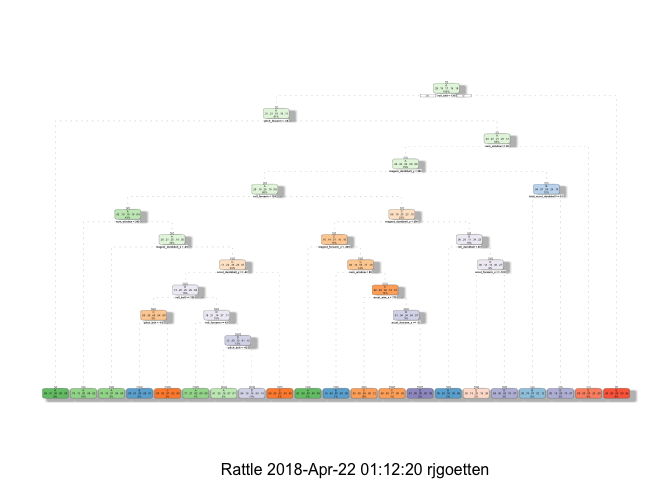

# Introduction  
Using devices such as Jawbone Up, Nike FuelBand, and Fitbit is a way to monitor your level of activity. People are regularly quantifying how much of a particular activity they do, but they rarely quantify how well they do it.  

Six participants were asked to perform one set of 10 repetitions of dumbell lifts in 5 different styles (1 correctly and 4 incorrectly). In order to collect the data, accelerometers were placed on their belts, forearms, arms, and dumbells.  

The goal of this project is to analyse the data and try to predict the manner in which they did the exercise.  

The data for this project come from this source: http://groupware.les.inf.puc-rio.br/har.  

For the purpose of this project, the following steps will be followed:  
1. Data Processing  
2. Cleaning and Preparing Data  
3. Prediction Models  
4. Applying the Selected Model to the Test Dataset  

# Data Processing  
The first step will be to upload all the libraries that are necessary for the analysis, and set a seed to make it reproducible.

```r
library(knitr)
library(caret)
```

```
## Loading required package: lattice
```

```
## Loading required package: ggplot2
```

```r
library(rpart)
library(rpart.plot)
library(rattle)
```

```
## Rattle: A free graphical interface for data mining with R.
## Version 5.0.14 Copyright (c) 2006-2017 Togaware Pty Ltd.
## Type 'rattle()' to shake, rattle, and roll your data.
```

```r
library(randomForest)
```

```
## randomForest 4.6-14
```

```
## Type rfNews() to see new features/changes/bug fixes.
```

```
## 
## Attaching package: 'randomForest'
```

```
## The following object is masked from 'package:ggplot2':
## 
##     margin
```

```r
set.seed(12345)
```

Next, we load and read the training and testing sets from the source mentioned above, and then partition the training set further in 2 to create a Training set (70% of the data) for the modeling process, and a Test set (30% of the data) for the validations.   
The original testing dataset is not changed and will only be used for the quiz results generation.  

```r
trainURL <- "http://d396qusza40orc.cloudfront.net/predmachlearn/pml-training.csv"
testURL <- "http://d396qusza40orc.cloudfront.net/predmachlearn/pml-testing.csv"

training <- read.csv(url(trainURL))
testing <- read.csv(url(testURL))

dataPart <- createDataPartition(training$classe, p = 0.7, list = FALSE)
myTraining <- training[dataPart, ]
myTesting <- training[-dataPart, ]
dim(myTraining)
```

```
## [1] 13737   160
```

```r
dim(myTesting)
```

```
## [1] 5885  160
```

# Cleaning and Preparing Data   
Both datasets have 160 variables. The cleaning procedures below will remove the variables that have more than 95% NA's.
The Near Zero variance (NZV) and the ID variables are also removed.

```r
NZV <- nearZeroVar(myTraining)
myTraining <- myTraining[ ,-NZV]
myTesting <- myTesting[ ,-NZV]

dataPart <- apply(myTraining, 2, function(x) mean(is.na(x))) > 0.95
myTraining <- myTraining[, -which(dataPart, dataPart == FALSE)]
myTesting <- myTesting[, -which(dataPart, dataPart == FALSE)]

myTraining <- myTraining[ , -(1:5)]
myTesting <- myTesting[ , -(1:5)]

summary(myTraining$classe)
```

```
##    A    B    C    D    E 
## 3906 2658 2396 2252 2525
```

```r
summary(myTesting$classe)
```

```
##    A    B    C    D    E 
## 1674 1139 1026  964 1082
```

```r
plot(myTraining$classe, col="light blue", main="Distribution of the CLASSE Variable - Training Data Set", xlab="classe categories", ylab="count")
```

<!-- -->

The graph above shows us that each class is within the same order of magnitude of each other. Class A (which means, the exercise is been performed correctly) is the most frequent while class D is the least frequent.  

# Prediction Models  
Two methods will be applied to model the regressions in the myTraining dataset; the best one (with higher accuracy when applied to the myTesting dataset) will be used for the quiz predictions. 
The methods are:  Decision Tree and Random Forests.  

A Confusion Matrix is plotted at the end of each analysis to better visualize the accuracy of the models.  

In our models, **cross-validation** is performed by subsampling our training data set randomly without replacement into 2 subsamples: myTraining data (70% of the original Training data set) and myTesting data (30%). 


## a. Decision Tree Model

```r
modelDT <- rpart(classe ~ ., data = myTraining, method = "class")
fancyRpartPlot(modelDT) # view the decision
```

<!-- -->

```r
predictionDT <- predict(modelDT, myTesting, type = "class") # predict
confusionMatrixDT <- confusionMatrix(predictionDT, myTesting$classe) # test results
confusionMatrixDT
```

```
## Confusion Matrix and Statistics
## 
##           Reference
## Prediction    A    B    C    D    E
##          A 1530  269   51   79   16
##          B   35  575   31   25   68
##          C   17   73  743   68   84
##          D   39  146  130  702  128
##          E   53   76   71   90  786
## 
## Overall Statistics
##                                          
##                Accuracy : 0.7368         
##                  95% CI : (0.7253, 0.748)
##     No Information Rate : 0.2845         
##     P-Value [Acc > NIR] : < 2.2e-16      
##                                          
##                   Kappa : 0.6656         
##  Mcnemar's Test P-Value : < 2.2e-16      
## 
## Statistics by Class:
## 
##                      Class: A Class: B Class: C Class: D Class: E
## Sensitivity            0.9140  0.50483   0.7242   0.7282   0.7264
## Specificity            0.9014  0.96650   0.9502   0.9100   0.9396
## Pos Pred Value         0.7866  0.78338   0.7543   0.6131   0.7305
## Neg Pred Value         0.9635  0.89051   0.9422   0.9447   0.9384
## Prevalence             0.2845  0.19354   0.1743   0.1638   0.1839
## Detection Rate         0.2600  0.09771   0.1263   0.1193   0.1336
## Detection Prevalence   0.3305  0.12472   0.1674   0.1946   0.1828
## Balanced Accuracy      0.9077  0.73566   0.8372   0.8191   0.8330
```

```r
plot(confusionMatrixDT$table, col = confusionMatrixDT$byClass, 
     main = paste("Decision Tree - Accuracy =",
                  round(confusionMatrixDT$overall['Accuracy'], 4))) # plot accuracy
```

<!-- -->

**Expected out-of-sample error rate:**

```r
eoose <- (1-confusionMatrix(predictionDT, myTesting$classe)$overall[[1]])
eoose
```

```
## [1] 0.2632116
```


## b. Random Forest Model   

```r
modelRF <- randomForest(classe ~. , data=myTraining)

predictionRF <- predict(modelRF, myTesting, type = "class")
confusionMatrixRF <- confusionMatrix(predictionRF, myTesting$classe)
confusionMatrixRF
```

```
## Confusion Matrix and Statistics
## 
##           Reference
## Prediction    A    B    C    D    E
##          A 1674    7    0    0    0
##          B    0 1131    7    0    0
##          C    0    1 1019   12    0
##          D    0    0    0  952    4
##          E    0    0    0    0 1078
## 
## Overall Statistics
##                                           
##                Accuracy : 0.9947          
##                  95% CI : (0.9925, 0.9964)
##     No Information Rate : 0.2845          
##     P-Value [Acc > NIR] : < 2.2e-16       
##                                           
##                   Kappa : 0.9933          
##  Mcnemar's Test P-Value : NA              
## 
## Statistics by Class:
## 
##                      Class: A Class: B Class: C Class: D Class: E
## Sensitivity            1.0000   0.9930   0.9932   0.9876   0.9963
## Specificity            0.9983   0.9985   0.9973   0.9992   1.0000
## Pos Pred Value         0.9958   0.9938   0.9874   0.9958   1.0000
## Neg Pred Value         1.0000   0.9983   0.9986   0.9976   0.9992
## Prevalence             0.2845   0.1935   0.1743   0.1638   0.1839
## Detection Rate         0.2845   0.1922   0.1732   0.1618   0.1832
## Detection Prevalence   0.2856   0.1934   0.1754   0.1624   0.1832
## Balanced Accuracy      0.9992   0.9958   0.9953   0.9934   0.9982
```

```r
plot(confusionMatrixRF$table, col = confusionMatrixRF$byClass, 
     main = paste("Random Forest - Accuracy =",
                  round(confusionMatrixRF$overall['Accuracy'], 4))) #plot Accuracy RF
```

<!-- -->

**Expected out-of-sample error rate:**

```r
eoose <- (1-confusionMatrix(predictionRF, myTesting$classe)$overall[[1]])
eoose
```

```
## [1] 0.00526763
```

# Applying the Selected Model to the Test Dataset  
The accuracy of the 2 regression modeling methods above are: a. Decision Tree : 0.7368, b. Random Forest : 0.9947

In that case, the Random Forest model will be applied to predict the 20 different cases in the testing dataset, since this model is more accurate than the Decision Tree model.

```r
predictRF <- predict(modelRF, testing)
predictRF
```

```
##  1  2  3  4  5  6  7  8  9 10 11 12 13 14 15 16 17 18 19 20 
##  B  A  B  A  A  E  D  B  A  A  B  C  B  A  E  E  A  B  B  B 
## Levels: A B C D E
```
